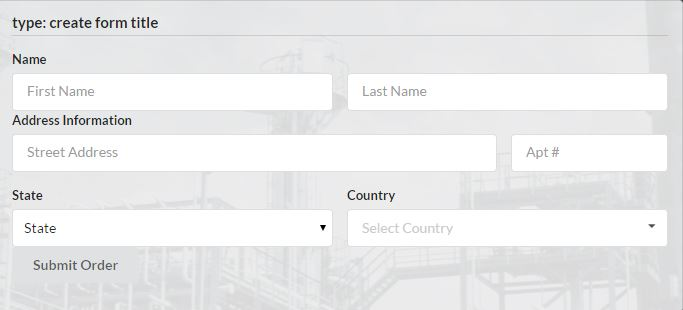

# Angular2 Forms Web Component
Angular2 Forms Web Component supporting multiple CSS Libraries such as Semantic UI &amp; Bootstrap while being configurable with JSON or POJO ("Plain old JavaScript Object").



By embedding the custom form directive in your html somewhere that is loaded via templateUrl or as an inline template in your View ("Component Selector"):
```html
<form style="five columns wide" [config]="config"></form>
```
We're telling the form component that we are wanting to bind to the "config" object.
This is handled by our main component that will kick things off:

```typescript
import {Component, View, AfterContentInit} from 'angular2/angular2';
import {SegmentComponent} from 'APPSOA/Components/Segment/SegmentComponent.ts';
import {FormComponent} from 'APPSOA/Components/Form/FormComponent.ts';

@Component({

    selector: 'dashboard',

})

@View({

    templateUrl: './DashboardTemplate.html',
    directives: [FormComponent, SegmentComponent ]

})

export class DashboardComponent implements AfterContentInit {

    public config: Object;

    constructor() {

        this.config = {

            title: 'create form title',

            buttons: {

                submit: true

            },

            groups: [

                { title: 'group for person', type: 'Person'},
                { title: 'group for location', type: 'Location'}

            ]

        };

    }

    afterContentInit() {

        // Do something wit your DOM element(s)...
        console.log('DashboardComponent.afterContentInit()');

    }

}
```

